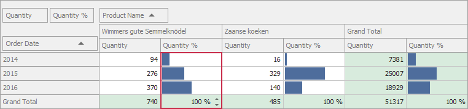

<!-- default badges list -->

<!-- default badges end -->
<!-- default file list -->

# Pivot Grid for WinForms - Assign In-Place Editors to Different Types of Cells

The following example shows how to handle the [PivotGridControl.CustomCellEdit](https://docs.devexpress.com/WindowsForms/DevExpress.XtraPivotGrid.PivotGridControl.CustomCellEdit) event to assign different in-place editors to different types of cells.

In the example, two in-place editors (repository items) are created to display values of the "Quantity %" field. The `ProgressBar` editor displays regular cell values as progress bars. The `SpinEdit` editor allows you to edit total values for the field.

## Files to Review

* [Form1.cs](./CS/PivotGridControl_CustomCellEdit/Form1.cs) (VB: [Form1.vb](./VB/PivotGridControl_CustomCellEdit/Form1.vb))
* [Program.cs](./CS/PivotGridControl_CustomCellEdit/Program.cs) (VB: [Program.vb](./VB/PivotGridControl_CustomCellEdit/Program.vb))

## Documentation

[Assigning Editors for In-place Editing](https://docs.devexpress.com/WindowsForms/5896/controls-and-libraries/pivot-grid/data-shaping/editing/assigning-editors-for-in-place-editing)

## More Examples

- [Pivot Grid for WinForms - Override the Cell Editor](https://github.com/DevExpress-Examples/how-to-override-the-cell-editor-used-for-the-in-place-editing-t515806)
- [Pivot Grid for WinForms - Edit Pivot Grid Cells in the UI and Store Cell Values in the Underlying Data Source](https://github.com/DevExpress-Examples/winforms-pivotgrid-how-to-edit-and-save-cell-values)

